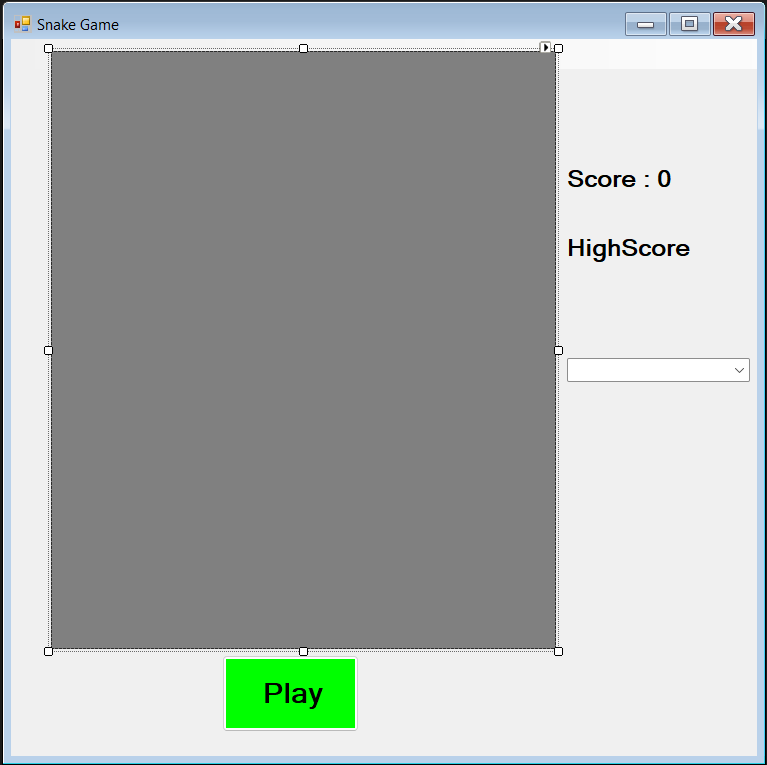

# Windows Applications Forms (WFA)

**Contexte**

Ce projet est une création de mini-jeu avec un choix large concernant le sujet. Il est demandé de créer notre mini-jeu avec le langage de programmation __C#__.

**Détail journalier du projet**

* *Jour 1* : création du Github, choix du mini-jeu, création de la base de notre WFA.

* *Jour 2* : Création du mini-jeu et finition

* *Jour 3* : Création des nouvelles fonctionnalités (Difficulté, amélioration du visuel)

* *Jour 4*: 